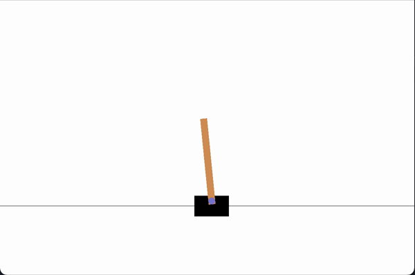
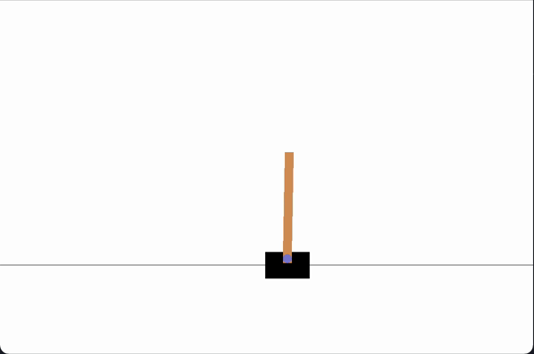

# NEAT_CartPole

CartPole is a great first game to attempt using Reinforcement Learning with, as it is a relatively easy game that doesn't take very long to train. Essentially there is a pole on a cart and your job (or rather the AI agent's job) is to move left or right and make sure the pole does not tip over. Here is what the game looks like when the agent is playing it for the first time.

Pre-training gameplay...



Scroll to the bottom for post-training results!

## Dependencies
Make sure you have successfully installed [NEAT](https://neat-python.readthedocs.io/en/latest/installation.html) and [gym](http://gym.openai.com/docs/#installation) onto your machine.

## Running the Program
For every script using the NEAT algorithm, there is an associated configuration file that houses all of the technical NEAT parameters. To solve the gym environment, there are two files: config_gym.txt and gym_cartpole_neat.py. Gym_config contains the technical parameters for the neuroevolution process and gym_solver.py is the program the creates the neural networks and solves the game. You will not need to adjust parameters for the cartpole game, however you would need to change these if you wanted to solve any other gym game.

If you open the gym_cartpole_neat.py file with an IDE like VsCode, there will be a section at the top for user parameters.
```
### User Params ###

GEN = 10 # max number of generations to evolve network
game_name = 'CartPole-v0' # name of game
STEPS = 1000 # max number of steps to take per genome
RENDER = True # renders game if true
CHECKPOINT = False # loads from checkpoint if true - must specify checkpoint later
EPISODES = 1 # Number of times to run a single genome. This takes the fitness score from the worst run
REPLAY = False # Replay game with best genome

### End User Params ###
```

I've tried my best to leave descriptive comments so every piece of code can be understood easily, so I won't delve into that here.

## Inputs and Outputs
For CartPole, there will be 4 inputs and 2 outputs. I will let you figure out what those are (hint: look at gym's website). These are designated in the config_gym.txt file, so if you are playing a game other than CartPole, you will need to modify these parameters.

I have the code configured so if you choose to play a game other than CartPole, the code will error initially but will display the required inputs/outputs in the terminal after running the script, like this:
```
Input Nodes: 4
Output Nodes: 2
```

You will then have to go into the config_gym.txt file and change the following parameters to match:
```
num_inputs              = 4
num_outputs             = 2
```

You will then be able to run the game successfuly after this. CartPole simulation should take less than 5 minutes with the original settings.

Here is a video of how the agent plays the game after only 1 simulation!


